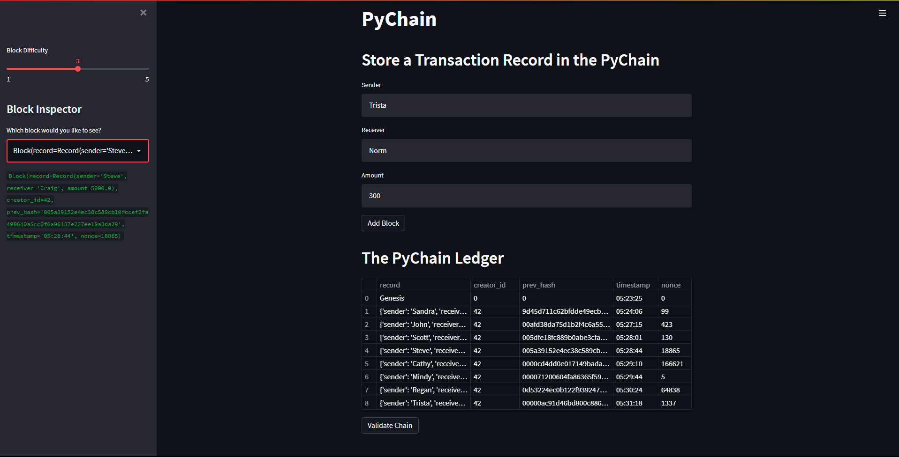
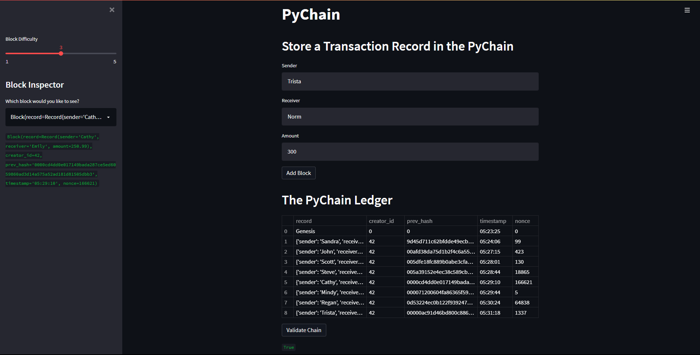

# PyChain Ledger
This prototype Streamlit application consists of a blockchain-based ledger system that allows the conduction of financial transactions through a user-friendly web interface. More specifically, it allows the transfer of money between senders and receivers, and verifies the validity of the data in the ledger.

## Technologies
The technologies required to use this project include: python 3.7 with pandas, dataclasses, typing, datetime, and hashlib. As well as streamlit. 

## Examples
Upon running the streamlit application, the users are presented with a screen that allows them to enter the "Sender", "Receiver", and "Amount" information into input textboxes. They can then click an "Add Block" button that allows them to add the transaction as a block in the blockchain-based ledger which is called the "PyChain Ledger". There is also a sidebar slider that allows the user to change the "Block Difficulty" which is used for performing the proof of work when adding the block to the blockchain ledger. The default difficulty is set to 2 and can vary from 1 to 5. The greater the difficulty, the longer it will take for the block to be added to the PyChain ledger. As part of the initialization process, a "Genesis" record is added as the first block on the blockchain and appears as the first row in the PyChain ledger.

**The PyChain Ledger:**

The PyChain ledger that is displayed is a pandas DataFrame consisting of the (transaction) record, creator_id, prev_hash, timestamp, and nonce of each block, shown as a row in the DataFrame. As a block is added, the PyChain ledger is updated. The record column shows the sender, receiver, and amount that was entered in the input textboxes.

**Block Inpector:**

In addition to being able to hover over a record or prev_hash in the PyChain ledger in order to see the complete information, there is also a "Block Inspector" selectbox in the sidebar that allows the user to look at the details of any block from the PyChain blockchain. Once the user selects a block from the selectbox list, the block details are displayed.

**Validate Chain:**

Lastly, the user can click on the "Validate Chain" button to validate the the PyChain blockchain ledger. If the PyChain is valid, "True" will be displayed on the screen.

Following is a demo video of the PyChain Ledger: 

https://user-images.githubusercontent.com/92467545/160748898-555d0215-5e5c-44dd-bc15-c3c2611c5398.mp4

